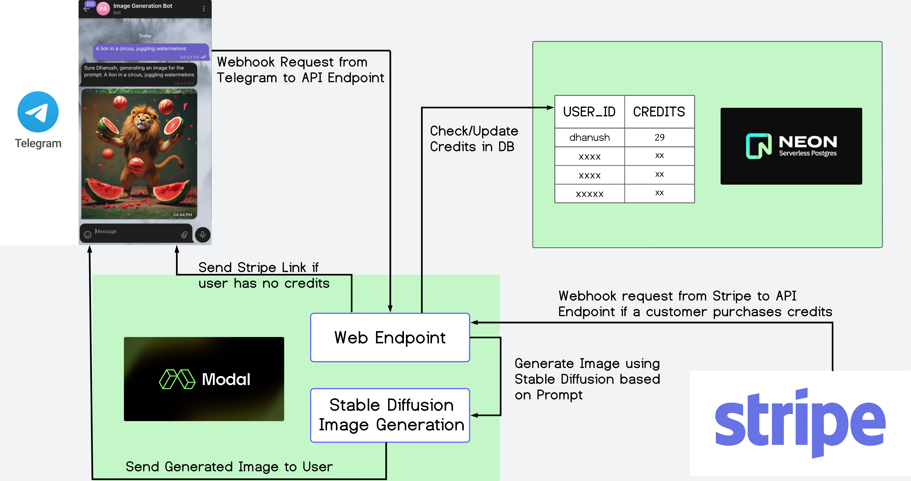

# AI Image Generation Bot

This repository contains the code for an AI-powered Telegram bot that generates images using Stable Diffusion. The bot integrates Modal Labs for serverless GPU computing, Neon for PostgreSQL database management, and Stripe for handling payments.

## Table of Contents
- [Features](#features)
- [Technologies Used](#technologies-used)
- [Prerequisites](#prerequisites)
- [Setup](#setup)
- [Project Structure](#project-structure)
- [How It Works](#how-it-works)
- [Future Enhancements](#future-enhancements)
- [Contributing](#contributing)
- [License](#license)

## Features

- Generate AI images based on text prompts via Telegram
- Serverless GPU-powered image generation using Stable Diffusion
- User credit system for image generation
- Integration with Stripe for purchasing additional credits
- Scalable PostgreSQL database for user management

## Technologies Used

- [Modal Labs](https://modal.com/) - Serverless GPU computing
- [Neon](https://neon.tech/) - Serverless PostgreSQL database
- [Telegram Bot API](https://core.telegram.org/bots/api) - Bot interface
- [Stripe](https://stripe.com/) - Payment processing
- [Stable Diffusion](https://github.com/CompVis/stable-diffusion) - AI image generation model
- Python - Primary programming language

## Prerequisites

Before you begin, ensure you have the following:

- A Modal Labs account
- A Neon account and database
- A Telegram bot token
- A Stripe account (test mode is fine for development)
- Python 3.7 or later

## Setup

1. Clone this repository:
   ```
   git clone https://github.com/yirenlu92/modal-neon-image-generator
   cd modal-neon-image-generator
   ```

2. Set up a virtual environment:
   ```
   python -m venv venv
   source venv/bin/activate  # On Windows, use `venv\Scripts\activate`
   ```

3. Install the required packages:
   ```
   pip install modal requests psycopg2-binary
   ```

4. Set up your environment variables in Modal as mentioned in the article:
   - `TELEGRAM_BOT_API_TOKEN`: Your Telegram bot token
   - `DB_CONNECTION_STRING`: Your Neon database connection string
   - `STRIPE_PAYMENT_LINK`: Your Stripe payment link

5. Deploy the app to Modal:
   ```
   modal deploy app.py
   ```

6. Set your Telegram bot's webhook to the Modal endpoint URL.

7. Set up a Stripe webhook to listen for the `checkout.session_completed` event, pointing to your Modal endpoint.

## Project Structure

- `app.py`: Main application file containing the Modal app definition and webhook handler
- `helpers.py`: Helper classes for Telegram bot interactions and database operations

## How It Works



1. Users interact with the bot via Telegram, sending text prompts for image generation.
2. The bot checks the user's available credits in the Neon database.
3. If credits are available, it uses Modal's serverless GPU to generate an image with Stable Diffusion.
4. The generated image is sent back to the user via Telegram, and credits are deducted.
5. When credits run out, users are prompted to purchase more via a Stripe payment link.
6. After successful payment, Stripe sends a webhook to the Modal endpoint, updating the user's credits in the database.
